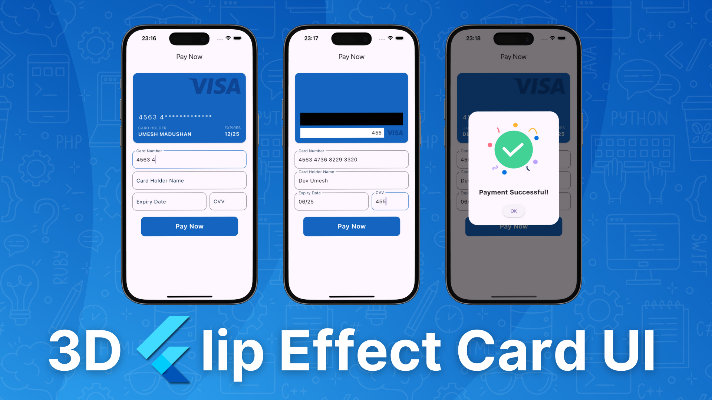

# 💳 3D Flip Card Effect With Payment UI




Creating a 3D Visa card flip effect for a payment UI in Flutter adds a dynamic and interactive element to the user experience. This effect allows users to seamlessly view both the front and back of the virtual card, providing essential information in a visually engaging manner. By utilizing Flutter's powerful animation capabilities, you can craft a smooth and responsive flip transition that enhances the overall functionality and aesthetic of the payment interface.


## 📦 Getting Started

### 1.Clone the repository:

```
git clone https://github.com/your-username/flutter-chat-app.git](https://github.com/umeshmadushan/card_payement_ui_flutter.git

```

### 2.Clone the repository:
```
cd project-file-name

```

### 3.Install dependencies:
```
flutter pub get
```

### 4.Run the app:
```
flutter run
```
